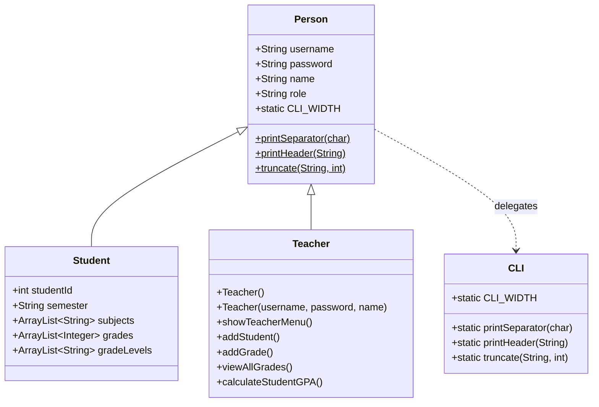

# 代码重构计划 - AP Grade Management System

## 1. 重构背景与原因

### 1.1 当前代码问题

当前 [`src/Person.java`](src/Person.java) 存在以下问题：

- **违反单一职责原则**: Person 类同时承担了用户管理、CLI 格式化、教师业务逻辑等多种职责
- **代码耦合度高**: CLI 工具方法与业务逻辑紧密耦合
- **可扩展性差**: 添加新角色（如管理员）需要修改 Person 类
- **内聚度低**: 无关功能堆积在同一类中

### 1.2 重构目标

1. 提高代码可维护性和可读性
2. 遵循面向对象设计原则（SRP, OCP）
3. 保持 Student.java 完全不变
4. 确保重构后所有功能正常工作

---

## 2. 待提取代码分析

### 2.1 CLI 格式化工具（CLI.java）

| 代码元素                           | 行号  | 说明         |
| ---------------------------------- | ----- | ------------ |
| `CLI_WIDTH`                        | 19    | CLI 宽度常量 |
| `printSeparator(char c)`           | 21-27 | 打印分隔符   |
| `printHeader(String title)`        | 29-38 | 打印标题     |
| `truncate(String str, int length)` | 40-44 | 截断字符串   |

### 2.2 教师相关功能（Teacher.java）

| 代码元素                | 行号    | 说明         |
| ----------------------- | ------- | ------------ |
| `showTeacherMenu()`     | 217-256 | 教师菜单     |
| `addStudent()`          | 299-315 | 添加学生     |
| `addGrade()`            | 318-332 | 添加成绩     |
| `viewAllGrades()`       | 335-345 | 查看所有成绩 |
| `calculateStudentGPA()` | 348-362 | 计算学生 GPA |
| Teacher 角色常量        | -       | "TEACHER"    |

---

## 3. 重构执行计划

### 步骤 1: 创建 CLI.java 工具类

```
src/CLI.java
├── CLI_WIDTH (常量)
├── printSeparator(char c)
├── printHeader(String title)
└── truncate(String str, int length)
```

### 步骤 2: 创建 Teacher.java 类

```
src/Teacher.java (extends Person)
├── 构造函数 (默认/参数化)
├── showTeacherMenu()
├── addStudent()
├── addGrade()
├── viewAllGrades()
└── calculateStudentGPA()
```

### 步骤 3: 修改 Person.java

- 完全移除 CLI_WIDTH, printSeparator, printHeader, truncate 方法
- 移除教师相关方法
- 不再保留包装方法（Student.java 将直接使用 CLI 类）

### 步骤 4: 更新文档

- 更新 `docs/PLAN.md`
- 更新 `README.md`

---

## 4. 类设计结构



---

## 5. Student.java 兼容性方案

采用 **方案 B**：Student.java 直接导入并使用 CLI 类的方法。

### 修改内容：

1. **Student.java 添加 import 语句**
2. **Person.java 完全移除 CLI 代码**

### Student.java 需要添加的 import：

```java
import static CLI.CLI_WIDTH;
import static CLI.printSeparator;
import static CLI.truncate;
```

或者使用：

```java
import CLI;
```

然后在代码中使用 `CLI.truncate()`, `CLI.printSeparator()`, `CLI.CLI_WIDTH`

---

## 6. 预期改进点

| 改进项   | 重构前                | 重构后         |
| -------- | --------------------- | -------------- |
| 类职责   | Person 承担多种职责   | 每个类职责单一 |
| 代码复用 | CLI 代码重复          | 独立工具类     |
| 可扩展性 | 添加角色需修改 Person | 新增类即可     |
| 可测试性 | 难以单独测试          | 可独立测试     |

---

## 7. 风险与缓解措施

### 7.1 风险识别

| 风险                | 影响 | 概率 |
| ------------------- | ---- | ---- |
| 破坏现有功能        | 高   | 低   |
| Student.java 不兼容 | 高   | 低   |
| 主方法入口改变      | 中   | 低   |

### 7.2 缓解措施

1. **功能完整性验证**: 重构后运行所有测试用例
2. **Student.java 修改**: 添加必要的 import 语句（使用 `import static` 简化调用）
3. **渐进式重构**: 逐步迁移而非一次性重写
4. **备份原文件**: 在实施前备份 Person.java

---

## 8. 执行顺序

1. ✅ 分析现有代码结构
2. ⏳ 创建 CLI.java
3. ⏳ 创建 Teacher.java
4. ⏳ 修改 Person.java
5. ⏳ 测试验证
6. ⏳ 更新文档
